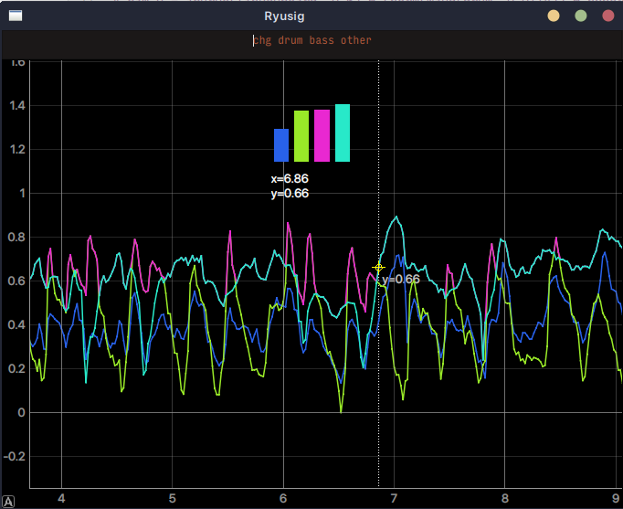
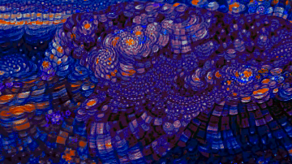

# Disco Party

A collection of libraries and scripts to take PyTTI, Disco Diffusion, Deforum, etc. to the next level.

## Ryusig

## pnodes.py

This script offers a new system to baking prompts and weights using a network of composable nodes.
This allows prompts to drift in and out on separate tracks, and was originally made to replace the scene system in PyTTI.
Several node types allow for various methods of sequencing.

A demo of this used in PyTTI can be seen in [Inflorescent Perceptions](https://www.youtube.com/watch?v=7FHZFIaeP4s).

## maths.py

Offers various math functions to use for creative coding.

